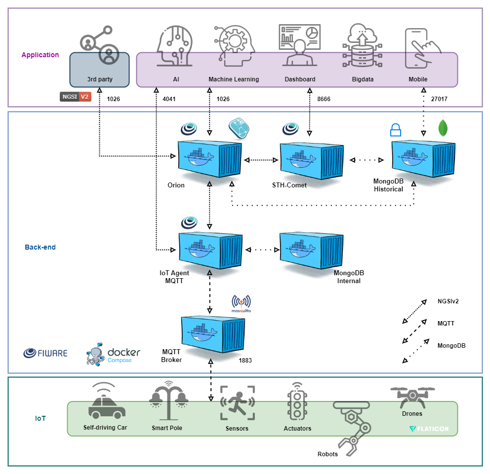

<div align="center">
  
  
  **Projeto acadêmico para Challenges e Checkpoints da FIAP**
  
  [](https://www.docker.com/)
  [](https://www.fiware.org/)
  [](https://mosquitto.org/)
  [](https://www.mongodb.com/)
  [](https://dash.plotly.com/)
</div>

## Sobre o Projeto

Este repositório foi criado para **colocar em prática o uso do FIWARE**, conforme apresentado pelo **Fábio Henrique Cabrini**, pesquisador oficial do projeto FIWARE. Utilizamos o **FIWARE Descomplicado**, uma modificação desenvolvida pelo pesquisador para facilitar a implementação e experimentação com a plataforma em ambiente acadêmico.

### O que é FIWARE?

O **FIWARE** é uma plataforma de código aberto criada em 2011 para desenvolvimento de soluções **IoT e cidades inteligentes**. Oferece Generic Enablers (GEs) padronizados que facilitam a interoperabilidade entre sistemas através do protocolo **NGSI**, permitindo conectar dispositivos, gerenciar dados contextuais e criar aplicações inteligentes de forma escalável.

**Links úteis:** [Site Oficial](https://www.fiware.org/) | [Tour Guide](https://fiwaretourguide.readthedocs.io/en/latest/)

### Grupo Stratfy - FIAP

**Membros:**
- **Anthony Sforzin**
- **Luigi Cabrini**  
- **Bruno K**
- **Rogério Arroyo**
- **Thayná Simões**

## Stack Tecnológica

### FIWARE Core
```yaml
# Generic Enablers Principais
Orion Context Broker 3.10    # Gerenciamento de dados contextuais
STH-Comet                    # Armazenamento histórico de dados
IoT Agent MQTT 4.0          # Gateway para dispositivos IoT

# Infraestrutura de Apoio
MongoDB 4.4                 # Base de dados NoSQL
Eclipse Mosquitto 2.0       # Broker MQTT
Docker & Docker Compose     # Containerização e orquestração
```

### Desenvolvimento & Visualização
```python
# Dashboard & Visualização
Python 3.8+                 # Linguagem base
Dash 2.14+                  # Framework web para dashboards
Plotly 5.15+                # Gráficos interativos
PyTZ 2023.3+               # Manipulação de timezone

# Hardware IoT
ESP32 DEVKIT V1            # Microcontrolador principal
Arduino IDE                # Ambiente de desenvolvimento
MQTT Protocol              # Comunicação IoT
```

## Instalação Rápida

### Pré-requisitos

#### Requisitos de Sistema
- **CPU:** 1 vCPU mínimo
- **RAM:** 1GB mínimo  
- **Armazenamento:** 20GB disponível
- **OS:** Ubuntu Server LTS (recomendado)

#### Software Necessário
```bash
# Atualizar sistema
sudo apt update

# Instalar Docker
sudo apt install docker.io

# Instalar Docker Compose
sudo apt install docker-compose

# Instalar Python 3 e pip (se necessário)
sudo apt install python3 python3-pip

# Verificar instalação
docker --version
docker-compose --version
python3 --version
pip3 --version
```

### Setup do Projeto

```bash
# 1. Clonar repositório do grupo Stratfy
git clone https://github.com/Stratfy/FIWARE
cd FIWARE

# 2. Verificar se Docker está rodando
sudo systemctl status docker
sudo systemctl start docker
sudo systemctl enable docker

# 3. Adicionar usuário ao grupo docker (opcional)
sudo usermod -aG docker $USER
# Após este comando, faça logout e login novamente

# 4. Configurar firewall UFW
sudo ufw enable
sudo ufw allow 22    # SSH
sudo ufw allow 80    # HTTP
sudo ufw allow 1026  # Orion Context Broker
sudo ufw allow 1883  # MQTT Broker
sudo ufw allow 4041  # IoT Agent MQTT
sudo ufw allow 8666  # STH-Comet

# 5. Verificar regras do firewall
sudo ufw status verbose

# 6. Executar FIWARE (navegar para pasta infrastructure)
cd infrastructure
sudo docker-compose up -d

# 7. Verificar se containers estão rodando
sudo docker ps

# 8. Testar APIs FIWARE
curl http://localhost:1026/version  # Orion Context Broker
curl http://localhost:8666/version  # STH-Comet
curl http://localhost:4041/version  # IoT Agent

# 9. Para parar os serviços
sudo docker-compose down
```

**Observações importantes:**
- **Azure NSG**: Configure regras inbound para portas 22, 1026, 1883, 4041, 8666, 80
- **MongoDB (27017)**: Mantido interno por segurança - não expor publicamente
- **Volumes Docker**: Dados persistem em `/var/lib/docker/volumes/infrastructure_mongo-historical-data/_data`

## Arquitetura do Sistema

### Configuração de Portas

| Porta | Serviço | Descrição | Status |
|-------|---------|-----------|--------|
| `1026` | **Orion Context Broker** | API NGSI-v2 | Público |
| `1883` | **Eclipse Mosquitto** | Broker MQTT | Público |
| `4041` | **IoT Agent MQTT** | Gateway para dispositivos | Público |
| `8666` | **STH-Comet** | Dados históricos | Público |
| `27017` | **MongoDB** | Base de dados | Interno |

### Componentes Principais

#### Orion Context Broker
Gerencia dados contextuais em tempo real, oferecendo **API RESTful** para captura, consulta e compartilhamento de informações de entidades IoT com suporte a geolocalização e notificações.

**[Documentação →](https://fiware-orion.readthedocs.io/en/3.10.1/index.html)**

#### STH-Comet  
Armazena e consulta dados históricos em larga escala, trabalhando junto ao Orion para **análises temporais** e dashboards através de API para séries temporais.

**[Documentação →](https://fiware-sth-comet.readthedocs.io/en/latest/)** | **[Queries API v2 →](https://documenter.getpostman.com/view/513743/RWEgqe8Q)**

#### IoT Agent MQTT
Facilita integração de dispositivos MQTT com o Context Broker, gerenciando **transformação de mensagens** e oferecendo descoberta automática de dispositivos.

**[Documentação →](https://github.com/FIWARE/tutorials.IoT-Agent)**


## Arquitetura em Camadas

A arquitetura é dividida em três camadas principais:

**Aplicação** - Interface front-end, dashboards, mobile apps e algoritmos de IA/ML  
**Back-end** - Orion Context Broker, STH-Comet, IoT Agents e bases de dados  
**IoT** - Dispositivos conectados via MQTT ou HTTP/NGSI-v2

<div align="center">
  
  
  *[Arquivo editável da arquitetura](resources/FiwareDeploy_new_v5.drawio)*
</div>

## Recursos e Materiais

### Coleção Postman
Collection completa para teste e configuração dos serviços FIWARE. Inclui exemplos para **Orion Context Broker**, **IoT Agent MQTT** e **STH-Comet** baseados na PoC Smart Lamp.

**[Download da Collection →](resources/FIWARE%20Descomplicado.postman_collection.json)**

### Exemplo Prático: Smart Lamp
Implementação de referência usando **ESP32 DEVKIT V1** com sensor LDR e controle via MQTT.

#### Características Principais:
- Monitoramento de luminosidade ambiente
- Controle remoto de LED 
- Comunicação bi-direcional via MQTT
- Sincronização de tempo via NTP

**[Guia de implementação →](docs/mqtt_esp32.md)** | **[Código ESP32 →](esp32/)** | **[Dashboard →](dashboard/)**

### Recursos Avançados
- **[FIWARE Step by Step](https://fiware-tutorials.readthedocs.io/en/1.0.0/index.html)** - Tutorial avançado
- **[Entity Relationships](https://documenter.getpostman.com/view/513743/fiware-entity-relationships/RVu8gSCh)** - Relacionamento entre entidades  
- **[NGSI v2 Subscriptions](http://telefonicaid.github.io/fiware-orion/archive/api/v2/)** - Subscrições condicionadas
- **[Catálogo FIWARE](https://www.fiware.org/catalogue/)** - Lista completa de componentes

## Segurança e Produção

### Observações de Segurança
**Esta ferramenta é destinada a pesquisa e PoCs.** Para produção, implemente os componentes de segurança FIWARE:

- **Keyrock** - Identity Management
- **Wilma PEP Proxy** - Policy Enforcement Point  
- **AuthZForce** - Authorization PDP/PAP
- **Protocolos seguros** - HTTPS, MQTTS

### Escalabilidade
Para alta disponibilidade, considere orquestradores como **Docker Swarm** ou **Kubernetes**.

---

### Dashboard Python
```bash
# Instalar dependências do dashboard
cd dashboard
pip3 install -r requirements.txt

# Executar dashboard de luminosidade
python3 api-sth.py
```

---

<div align="center">
  <h3>Desenvolvido para fins acadêmicos na FIAP</h3>
  
  **Explorando as possibilidades do FIWARE para IoT**
  
  *Material adaptado da [FIWARE Foundation](https://github.com/FIWARE/tutorials.IoT-over-MQTT)*
  
  *Baseado no trabalho do pesquisador **Fábio Henrique Cabrini** - FIWARE Descomplicado*
  
  **© Grupo Stratfy - FIAP 2025**
</div>
